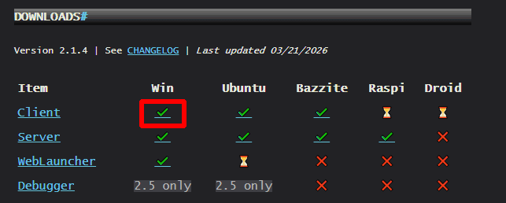

# Downloading

The latest version of ONB can always be found on the official website, 
[https://onb.frameskip.net/#downloads](https://onb.frameskip.net/#downloads){:target="_blank"}. Simply click the check mark that matches with the 
thing you're there for (probably the client) and the operating system you use 
(probably Windows). 

{ align=center }

Make sure to extract it before trying to open the engine.
