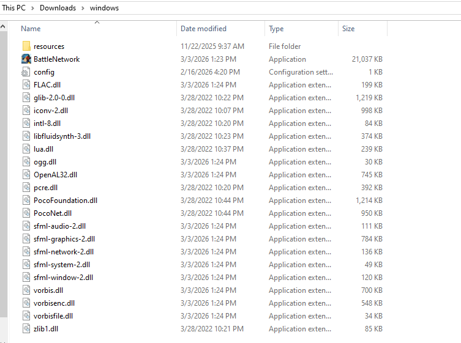
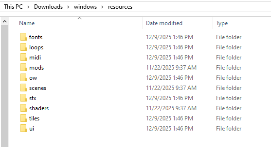
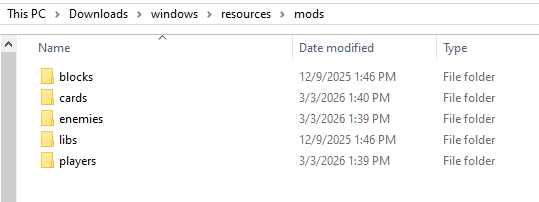
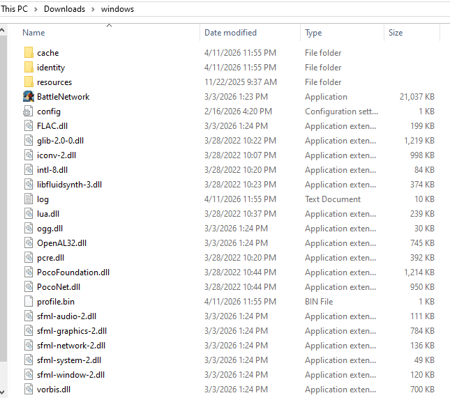

# The ONB Folder

This section shows off the files and the folder hierarchy in the ONB download 
folder. This includes where you'll find ONB's assets, if you want to modify 
them to suit your own tastes, and also the files that you'll want to save 
if you move to a new computer or download a new (or newer) copy of ONB.

## Top Directory

Once ONB is downloaded and extracted, you'll see something like this: 

{ align=center }

From here on and in other places on this website, this folder will be referred 
to as the "ONB folder".

The important things you see are:

* `BattleNetwork`, which is `BattleNetwork.exe` if you have visible extensions turned on. This is ONB, and it's what you will open to play.
* `config` (or `config.ini`) if you have visible extensions turned on. This contains your controller configurations, among other things.
* `resources`, where you'll find all images and music used in ONB, as well as the place where you'll put your mods later.

The rest is a bunch of `.dll` files, which are necessary for ONB to run. 

A few more files will appear here later, once you've played ONB. These will 
be covered later.

## The `resources` Folder

If you open the `resources` folder, you'll see something like this:

{ align=center }

With the exception of the `mods` folder, all of these folders carry the assets 
ONB uses. Things like the Tiles on the Field, menu widgets, and sound effects. 
Some users have replaced some of these files with their own edits, but if you 
do, be sure to watch out for when a new ONB version adds new assets or changes 
existing ones.

The one you'll be interacting with most is the `mods` folder.

### The `mods` Folder

The `mods` folder is at `resources/mods`. That means, starting from the 
ONB folder, enter the `resources` folder, then the `mods` folder. From here 
on, and in other places of the website, this will be referred to as the `mods` 
folder.

Inside, you'll see something like this:

{ align=center }

There's a folder for each type of mod. When you download a mod package (a ZIP 
file containing a single mod's files), you'll put them in their respective 
folder before launching ONB. 

If you enter one of these folders after launching, you'll notice all the mod 
packages will have extracted themselves. ONB does this on launch, and you 
should let it. 

!!! info "Extracting Mods"
    Do not extract individual mod packages on your own, since ONB 
    will do it in a special way. Do not delete the mod package ZIP files afterwards. 
    If you want to delete a mod, you must delete the mod package ZIP as well as the 
    extracted folder. If you delete only one, the other will come back when you next 
    launch ONB.

### `homepage.tmx`

If you look around a bit, you'll notice a `homepage.tmx` file in `resources/ow/maps`. 
This is the Tiled map file for the homepage. You can edit this as you like, but you 
should know that homepages are planned to be removed in v2.5.

This doesn't mean your edits will be lost. The reason for homepage removal in 
v2.5 is that servers are more powerful, and you can very easily run a server 
for yourself that includes this very map file. You can just move it over, then 
connect to your personal server (which, unlike the homepage, can be set up to 
allow your friends to visit, if you know what you're doing). Setting this up 
will be covered in another section once v2.5 releases. 

## Extra Files

After you've played ONB a bit, you'll notice that your ONB folder has a few new 
files in it. With all of them, your folder will look something like this:

{ align=center }

The new items are:

* `cache` folder, created when you joined a server or fought another player.
Contains temporary files to make loading faster. 
* `identity` folder, created when you joined a server. Contains files corresponding 
to the servers you've joined, which has a secret key that lets a server identify 
you. Think of each file like a server username/password.
* `profile.bin`, created when you opened ONB. Contains all of your in-game 
folders of chips, and the Customizer setup you have for each Player mod.
* `log.txt`, created when you opened ONB. Contains all of the log lines ONB 
made. If someone asks you for your log, they mean this, not the black window 
you might have seen open with ONB (that's the `cmd`, which shows a subset of 
the logs for the current session. More on that in another section). It's always 
growing, so feel free to delete it from time to time.

## Files to Save

If you ever need to upgrade to a newer ONB version, or you're moving to another 
computer, or any other reason, there are a few files you might want to bring 
to another ONB download, in order of importance:

* The `identity` folder, so servers you play on still know who you are
* The `profile.bin` file, so you don't lose your in-game chip folders or 
Customizer setups
* The `config.ini` file, so you don't lose your controls or set display name
* Your `mods` folder, which has all your mods
