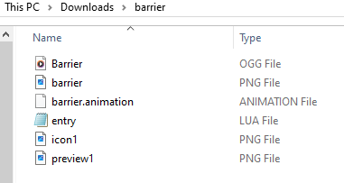
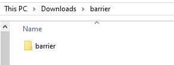
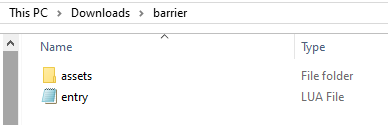

# Loading New Mods

This page will cover the typical way to load a new mod into ONB, assuming you
already have one. Maybe a friend has sent you a singular mod over Discord and 
you need to get it loaded.

This is the barebones, original process, which is streamlined if you download 
from one of the mod websites instead, covered in another section. 
Still, knowing how mods are added without that help can be useful for 
situations like the above.

## One Mod

A singular mod file will be one ZIP file, the insides of which contain the 
mod files. It is *NOT* a ZIP file that contains a folder that contains the 
mod files. It must have an `entry.lua` in the uppermost directory.

**Good, actual mod**:

{ align=center }

**Bad, will not load** (`barrier` folder inside `barrier.zip`, no `entry.lua` here):

{ align=center }

**Good, actual mod** (`entry.lua` is at the top directory):

{ align=center }

!!! info "Extracting"
    Do not extract individual mod packages on your own. ONB 
    will do it in a special way on boot. 

!!! info "Zipping"
    If you want to send your friend or someone else your mod, you might feel 
    like zipping up the folder and sending that. Do not do this. Instead, send 
    the ZIP file that was either generated or updated by ONB on the latest boot. 
    This preserves the MD5 hash, which helps two clients identify a mod owned by 
    both of them.

## Mods Folder

You'll want to get your mod over to the `mods` folder.

Starting from your ONB folder, go into the `resources` folder, then into the 
`mods` folder.

{ align=center }

{ align=center }

{ align=center }

You should know what type of mod you're trying to load, so put the ZIP file 
into the corresponding mod folder. Then, launch ONB and the mod should load.

If you don't know what type of mod you have, you can usually identify it from 
the contents of the `entry.lua`. 

* Check the package ID. Modders usually include the type of mod in the ID. 
You can find this in the `package_init` function, usually as the first line. 
It's the text on the line that has `declare_package_id` in it
* Check for identifying functions. If you see `function card_create_action` 
somewhere, it's probably a `card` mod. If you see `function player_init`, it's 
probably a `player` mod. With `function package_build`, it should be a `mob`, and 
if you see anything setting a shape and a mutator, it should be a `block`. 
If none of those are around, `libs` is a safe bet.

If you can't figure it out and put it in the wrong folder, the mod will fail 
to load, which you can see told to you as an error in the black console window 
that opens with ONB. You should make sure to fully remove the mod from the 
incorrect folder before trying another folder.