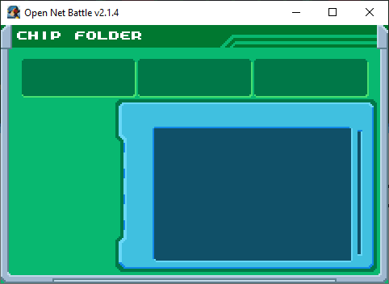
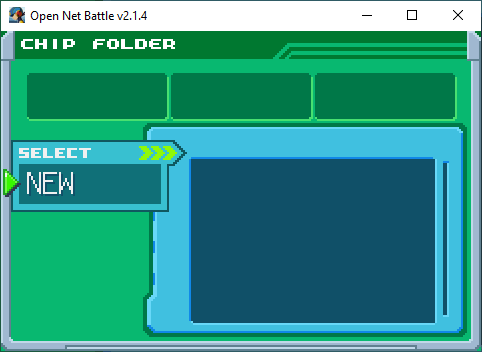
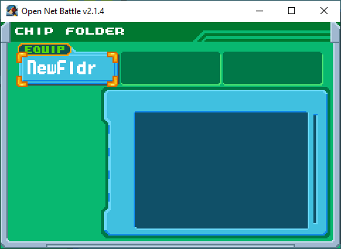
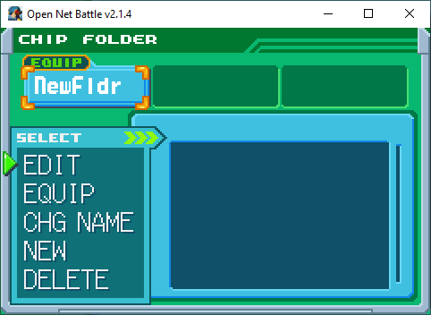
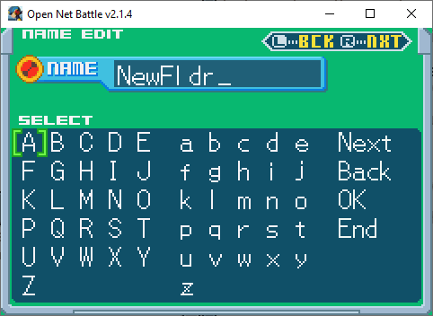

# Chip Folder

Once you've gone through the [Start menu](./start_menu.md) to get to the Chip 
Folder screen, you'll see this:

{ align=center }

This page goes over what you can do here.

## Create Folders

First, you need to make a new folder. Press the Confirm button

{ align=center }

{ align=center }

## Folder Options

Now that you have a folder, you can click Confirm on it to get some new 
options.

{ align=center }

You can select these options using the UI Up/Down keys, and then Confirm.

### Edit

Most importantly, you can click `EDIT` to reach the Folder Edit screen. This 
has [its own page](./folder_edit.md), which you can read later.

### Equip

If you click the `Equip` button, you'll equip this folder. It'll be what you 
use in battle.

!!! info "Equip Twice"
    If you equip the same folder twice, you might actually "undo" your equip.
    This is because, behind the scenes, the folders swap places, but they 
    haven't visually swapped yet.

### Change Name

If you click the `CHG NAME` button, you'll open a new screen, where you can 
edit the folder name.

{ align=center }

As an experience just like BN6, you'll be using inputs to select letters. The 
UI keys move your cursor here, and Confirm adds the letter. Cancel deletes 
a letter.

Press Confirm on the OK button to save changes. Press it on the END button to 
exit without saving.

You can use the left/right shoulder buttons to move the current letter selection 
in the name. For example, at first, selecting a letter with Confirm will replace 
the `N` in my folder's name, in the above image. If I press the Shoulder R 
button, it'll replace the `e` instead.

### New

You can create a new folder. Unlike BN games, you aren't limited to only three. 
You can keep creating and the screen will scroll to the right.

### Delete

Deletes the folder.

## Other Controls

You can use UI Left/Right to move between folders, so you can click on them 
and get the options popup.

You can also use UI Left/Right to scroll through the folder preview window, 
which shows the chips in the folder.

## Saving Changes

No changes, including any name edits or even chip edits, are saved until you 
leave this menu. If you accidentally do something without meaning to, 
you could close ONB as a last resort to undo it. Otherwise, make sure to 
leave the menu to save first.
