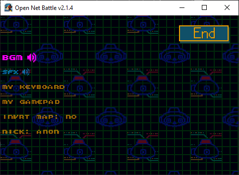
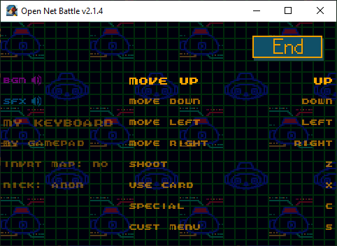
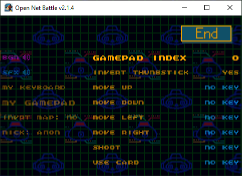
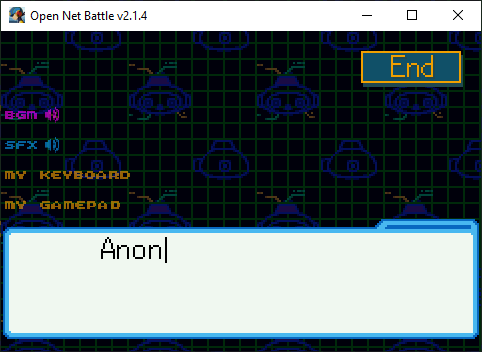
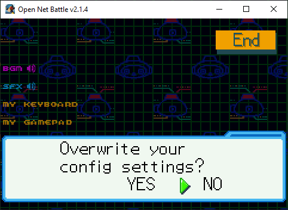

# Config Screen

Once you've gone through the [Start menu](./start_menu.md) to get to the Config 
screen, you'll see this:

{ align=center }

This page goes over each of these options.

## Navigation

The UI Left, UI Right, UI Up, and UI Down keys change selections on this 
screen. By default, these are you arrow keys on keyboard. Use either UI Right 
or Confirm (Z by default) to toggle and prompt other input. The Cancel button 
(X by default) will unselect something, or bring you to the `End` button you 
see in the corner.

## Volume

First you'll see the `BGM` and `SFX` options. Press UI Left or UI Right (arrow 
keys by default) to raise or lower them. Confirm (Z key) also raises them. 

You might have noticed that ONB is pretty loud, so this is how you'll quiet it 
a bit. 

## All Controls

The `My Keyboard` and `My Controller` options will let you edit your controls, 
but first, you can read about what all of the controls are for. If you've 
played any BN games on mGBA, these controls will be familiar.

Controls are split between overworld/battle and menues. The overworld/battle 
controls are: 

* **Move Up/Down/Left/Right** - Moves you. Arrow keys by default.
* **Shoot** - Triggers your normal attack in battle. `Z` by default.
* **Use** - Uses a held chip in your hand during battle. `X` by default.
* **Special** - Uses your special attack in battle (think of it like a 
B+Back hotkey, if you remember abilities like Shield from the games). `C` by default.
* **Cust Menu** - Opens the Custom Screen when the Custom Gauge is full. `S` by default.
* **Pause** - Opens the menu, pauses battle, and sometimes gives other options. `Enter` by default
* **UI Up/Down/Left/Right** - Moves UI, like changing options in a menu. 
Recommended to be the same as Move Up/Down/Left/Right. Arrow keys by default.
* **Confirm** - Confirms, selects, etc. `Z` by default. BN games would match this 
with the `Use` button.
* **Cancel** - Cancels, unselects, etc. `X` by default. BN games would match this 
with the `Shoot` button.
* **Option** - Misc usage. Think of it like the `Select` button on GBA. `C` by 
default. Recommended to be rebound so it doesn't match `Special` in battle, 
but it's not an issue.
* **Run** - Hold to run on the overworld. BN games would match this with the `Shoot` 
and `Cancel` buttons.
* **Shoulder L** - Usually for scrolling or rotating, but can be read in battle by 
mods. `A` by default.
* **Shoulder R** - Usually for scrolling or rotating, but can be read in battle by 
mods. `S` by default.
* **Minimap** - Opens the minimap on the overworld, if available. In battle (debug only), 
flips perspective. `M` key by default.
* **Advance Frame** - If debug is enabled, activates framestep mode. Clicking again 
advances a single frame. 
* **Resume Frames** - If debug is enabled, deactivates framestep mode.
* **Record Frames** - Currently disabled, but if it did do something, it would start/stop 
"recording" frames by saving images of each frame in a new `recording` folder.

There are a few things to notice here. 

### So Many Inputs

First, there are a lot of inputs that seem duplicated, like all those UI buttons 
compared to Move buttons, and `Shoot`, `Cancel`, and `Run` all being separate buttons 
when you expect them to be the same, like they would in BN. There's no problem if 
you want to change then to all match.

### One Cust Button?

Second, if you've played the games, you'll notice that `Cust Menu` is only one 
button, when the games use either shoulder button to open the Custom Screen. 
You'll get used to it. 

Because the shoulder buttons are also separate inputs, you might consider binding 
the `Cust Menu` to a different button entirely, to give you an advantage if you 
use a Player mod that uses the shoulder buttons to do something, so you can avoid 
accidentally opening Custom at the same time.

### Special Button?

The Special button looks new. Like mentioned above, you can think of this as a 
hotkey for "B + Back", which activated abilities like Shield in the BN games. 
Player mods use this instead of trying to read any B + Back inputs. 

When you use Specials, you might see enemy HP disappear, and you held chips 
spread out. This is actually a function of the Option button, not Special, 
which is why I recommend rebinding Option. 

### Debug?

Some of the inputs above only work in debug mode. You can activate this by 
passing the `-d` flag when launching ONB. If you don't know what that means, 
another section will cover it.

## My Keyboard

If you click into the `My Keyboard` option (with Confirm or UI Right input), 
you'll see a list of all the controls and their current key bindings. 

{ align=center }

Click `Confirm` on these to edit them. Your next key press will become the 
new input for this button. 

Any changes made will not take effect until you click the `End` button and 
save changes. 

## My Gamepad

If you click into the `My Gamepad` option (with Confirm or UI Right input), 
you'll see a list of all the controls and their current key bindings. None 
of these are assigned by default.

{ align=center }

Click `Confirm` on these to edit them. Your next controller button press will 
become the new input for this button. If your controller doesn't work, make 
sure it's the gamepad in the slot selected (0 by default), or make sure ONB 
was not opened before the gamepad was plugged in and turned on. 

Some users have had trouble with wireless controllers, or wireless controllers 
with low battery, or controllers that were not in the first slot.

Any changes made will not take effect until you click the `End` button and 
save changes. 

## Invert Map

You can click Confirm or UI Right to toggle this between `ON` and `OFF`. Changes 
which direction to pan the minimap when using UI Up and UI Down.

## Nickname

You have a nickname that will display to other players in online areas. 
Servers also use this sometimes to refer to you, like when you leave a post on 
a BBS board.

You can change that here by clicking the `Nick` option with Confirm or UI Right. 
This prompts you to type in a new name.

{ align=center }

There's a 9 character limit. Use your keyboard as normal, and press Enter 
when you're done.

## Save Changes (End)

Whenever you're done making changes, you can leave the menu and save by pressing 
Cancel (or UI Up until you reach it) to get to the `End` button, then press 
Confirm to select it. It'll ask if you want to save these changes.

{ align=center }

Use UI Left/Right and Confirm to select here. Hopefully you don't accidentally 
click `NO` when you do want to save it. If you press Cancel again here, it won't 
save.
