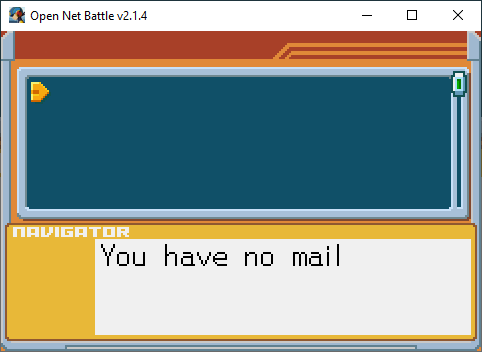
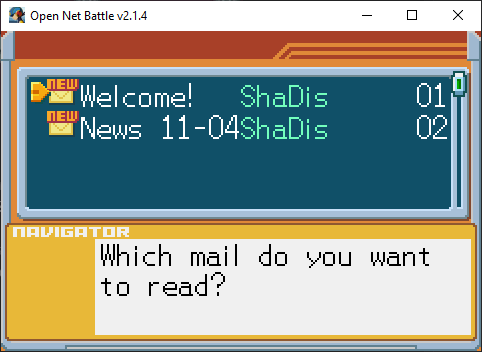
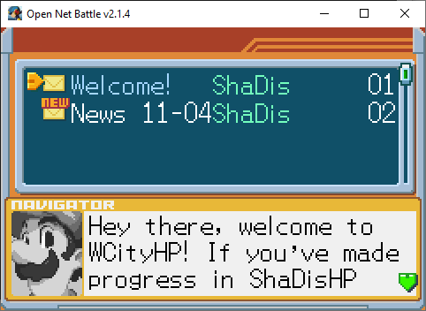

# E-Mail

If you've scrolled down the [Start menu](./start_menu.md) to get to the E-Mail 
screen, you'll see this:

{ align=center }

You probably don't have any right now.

## Receiving Mail

This screen is reserved for server use. Servers you visit may fill this screen 
with mail while you play, or when you join. The mail will stay on that server, 
disappearing when you jack out or go to another server.

## Reading Mail

Here's how the screen might look when you do have some mail:

{ align=center }

Here, I've joined the WCityHP server, by ShaDisNX255, where I received some 
mail on join.

You can press the Confirm button to read mail, or the UI Up/Down/Left/Right
buttons to scroll through your mail. 

{ align=center }
