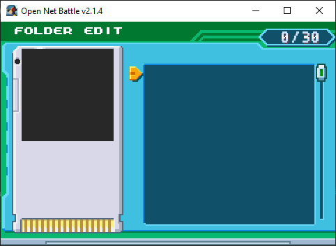
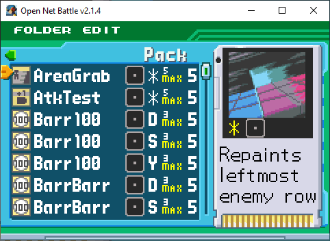
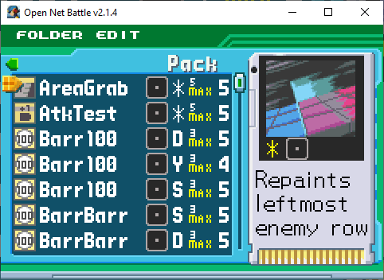
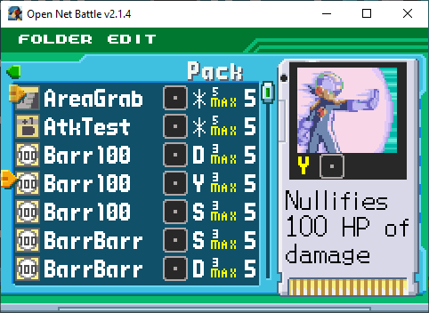
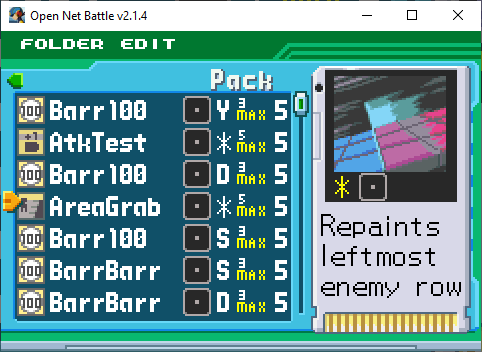
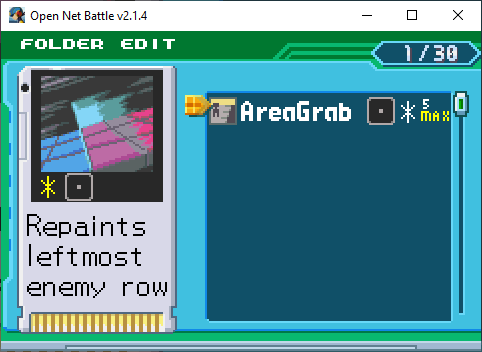
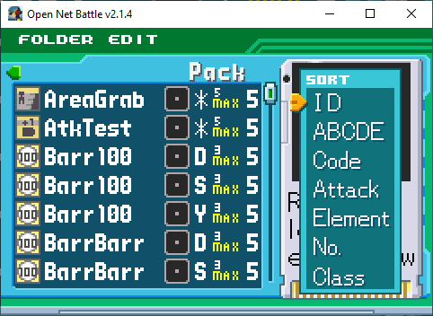
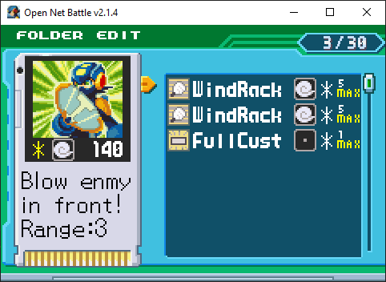

# Folder Edit

Once you've selected `EDIT` from the [Chip Folder screen](./chip_folder.md), 
you'll be able to edit the chosen folder.

## Two Screens

Folder edit is split between two different screens. The first is the folder 
itself, which is empty right now.

{ align=center }

The second is the Pack, which shows all of your installed card mods. You 
can get here by clicking the UI Right button (right arrow key by default).

{ align=center }

Most of your editing time will be spent here.

## Scrolling

You can scroll through your chips using UI Up/Down (hold to go faster), and 
the shoulder buttons. The shoulder buttons jump multiple chips at once, so 
if you have a long list, you'll want to use them.

## Adding Chips

You can add chips from the Pack in a couple ways. If you press the Confirm 
button, you'll have selected the chip at the cursor.

{ align=center }

You can see the cursor hanging around this chip. If you press Confirm again...

{ align=center }

The chip gets added to your folder. See how its `5` went to `4`. If you move 
back to your folder with UI Left, you'll see that it was added to the first 
empty slot.

{ align=center }

You can also add a chip by swapping it with a chip slot, even an empty one, 
in your folder.

## Swapping Chips

If you press Confirm on a chip, you can then scroll to another chip and press 
Confirm to swap their position. 

{ align=center }

{ align=center }

This doesn't do much in your Pack, but you can also swap a Pack chip with a 
folder chip like this, or swap your folder chips with each other to reorganize.

## Removing Chips

You can remove chips from your folder in the same way you can add them from 
the Pack. Press the Confirm button to select the chip, then press the Confirm 
button again on the same chip.

{ align=center }

{ align=center }

## Sorting Chips

In both your folder and the Pack, you can press the Pause button (Enter by 
default) to bring up the chip sort options.

{ align=center }

You can sort by:

* **ID** - Alphabetically based on package ID. The default, but not that useful 
because package IDs can be anything. Usually acts similar to sorting by author.
* **ABCDE** - Alphabetically based on chip name.
* **Code** - Alphabetically based on chip code. 
* **Attack** - Sorts low to high printed damage.
* **Element** - Sorts Elements together based on an internal order. Fire first, 
Null (None) last.
* **No.** - Sorts lowest to highest remaining count. A bit useless, since everything 
has 5 copies in v2.1.
* **Class** - Sorts Card Class together. Standard first, Dark last.

If you click the same sort that is already active, it will reverse the order. 
For example, if you click `ABCDE` twice, you will sort in reverse alphabetical 
order.

## Copy/Paste

You can copy and paste folders to share with friends, or to act as templates 
for yourself.

### Copying

If you're viewing your folder, press the copy shortcut (Ctrl + C). You'll 
hear a sound, confirming that your folder has been copied.

Take this folder, with 3 chips.

{ align=center }

Here's what was copied to my clipboard:

````
```
# Folder by Alrysc
com.alrysc.card.WindRack,1bca70da091a7fc8048454eb58f4bec0,*
com.alrysc.card.WindRack,1bca70da091a7fc8048454eb58f4bec0,*
com.OFC.card.EXE6-176-FullCustom,e256e03545a5008cffebd6479769069f,*
```
````

The first line includes the name you set in the [Config screen](./config.md).

Each line after that shows a chip's package ID, MD5 hash (essentially, their 
version), and their chip Code.

### Pasting

You can paste these copied chips into an empty folder. If you're not in 
an empty folder, it doesn't work.

With a proper folder copied, press the keyboard paste shortcut (Ctrl + V) 
to paste the chips in. You should hear one of two sounds:

1. The boost consumption sound, good: Everything pasted perfectly.
2. An error sound, bad: Something went wrong.

If you hear the error sound, check the console window (the black window that 
opened with the game) to see what went wrong. Sometimes, it's nothing to 
worry about. Here are the list of possible error causes:

1. At least one of the chips you tried to paste isn't installed
2. At least one of the chips you tried to paste is installed, but the paste 
wanted a different version than you had
3. At least one of the chips you tried to paste doesn't come with the Code 
the paste had
4. At least one of the chips you tried to paste couldn't be added for another 
reason, like if it exceeded the copy limit

Some errors will still let the chip be added, but others won't.

## Folder Limits

A folder can only have up to 30 chips. These can be nearly any combination 
of chips. Some of the limitations are more lax than BN. For example, you 
are allowed to use folders with less than 30 chips, too. 

Once v2.5 releases, servers will have the power to modify many of these 
limits, and may choose to be more faithful to the games.

### Class Limits

In v2.1, folders lack some of the limits you expect of BN. For example, 
you can add as many Mega, Giga, and Dark class chips as you want. If playing 
PvP, you and your opponent might agree to follow these rules regardless.

### Copy Limits

The limit on the number of copies of a unique chip your folder can have has 
changed across the BN series. In BN6, this is based on a chip's `MB` (Megabyte) 
value. In v2.5, ONB also will use `MB`, but for now, we have specified copy 
limits generally ranging from 1-5.

You can have as many copies of a chip in your folder as the chip mod indicates. 
In the folde rand pack, you'll see this as text on the right, next to the chip 
Code. 

Some chips don't specify a max, so it says `No Max`. You'll still be limited 
to 5 copies per Code, but can add 5 more copies of another Code for chips like 
this.

## Cannot Select Folder

If you're on a server with a whitelist, and your folder contains any chips 
that are not allowed, your folder will be greyed and unselectable.

{ align=center }

You can read more about this on the [page about whitelists](../whitelists.md)
