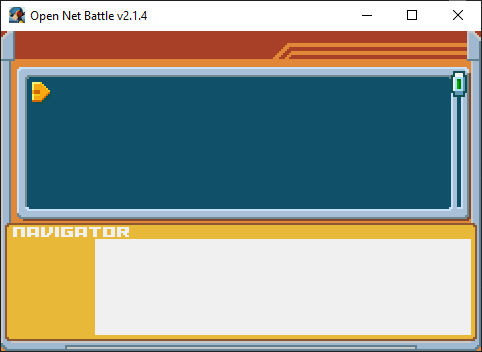
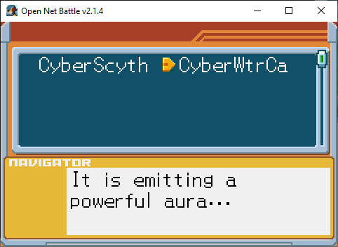

# Key Item

Scrolling down the [Start menu](./start_menu.md), you can get to the Key Item 
screen.

{ align=center }

You probably don't have any right now.

## Receiving Key Items

This screen is reserved for server use. Servers you visit may fill this screen 
with key items while you play, or when you join. These items will stay on that 
server, disappearing when you jack out or go to another server.

Here's how the screen might look when you do have some:

{ align=center }

Here, I've joined the GravyYum server, by Keristero, where I found some items 
that were added to my Key Items.

You can scroll around this screen using UI Up/Down/Left/Right. Having the 
cursor on an item will put a description in the text box.
