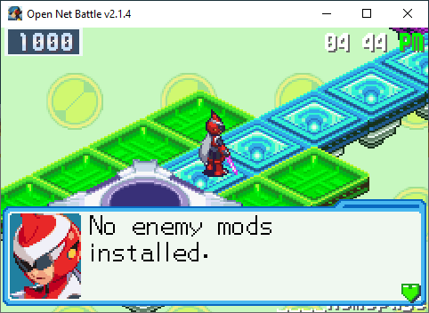
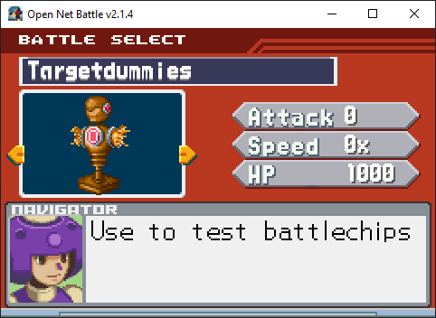

# Mob Select

If you go down the [Start menu](./start_menu.md), you can get to the Mob 
Select screen. Here, you can start battles with Mob packages you have 
downloaded.

If you don't have any, you'll be told there's nothing to do here.

{ align=center }

But if you do, you'll see the previews for your Mob packages.

{ align=center }

From here, use the UI Left/Right to switch the Mob you're previewing, 
or press Confirm to start the battle.

## Dependencies

Some Mobs are programmed to depend on another Mod being installed. You'll 
sometimes see this for things like V1 bosses compared to V2 bosses. The 
V2 boss might require that you also have the V1 boss installed.

This technically isn't because they depend on the Mob itself, but often 
Character scripts are defined within Mob packages, and so the other mod might 
need that Character to be defined before they can load.

If you don't have the dependency, the Mob package likely failed to load.
