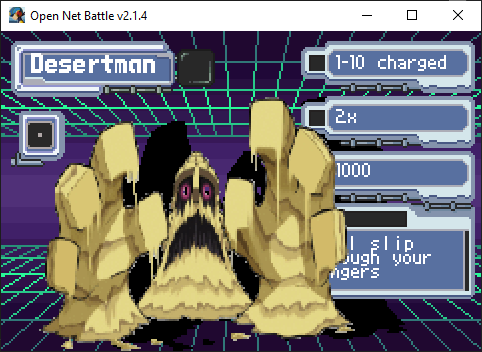
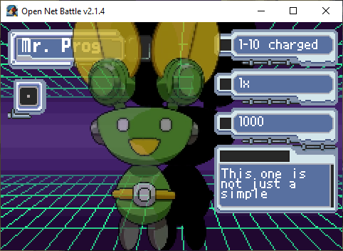
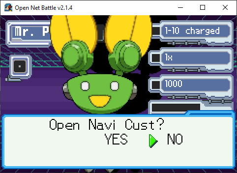

# Mob Select

If you make your way to the `Navi` button on the the 
[Start menu](./start_menu.md), you can open the Navi select screen. 
You can choose the Player mod to use here, as well as open the NaviCust.

## Choosing Players

The menu will open to the currently-selected Player mod.

{ align=center }

In this case, it's DesertMan. You can see its default HP, element, 
attack level, and a description. You can ignore most of the other 
numbers here, as they don't affect anything.

You can use the UI Left/Right buttons to scroll to another Player mod.

{ align=center }

You can press Confirm to select this Player mod.

## Navi Cust

Press Confirm on the selected Player mod. You'll get a prompt asking to open 
the Navi Cust.

{ align=center }

You can have a different Navi Cust configuration for every Player mod. It's 
tied to their ID, so as long as the ID doesn't change, you can even replace 
the mod with an updated version and you will still have that Navi Cust 
configuration.

The Navi Cust screen itself is explained on [its own page](./navi_cust.md), 
which you can read later.
