# Navi Customizer

Once you've clicked into it from the [Navi screen](./navi.md), you'll see 
your Navi Customizer.

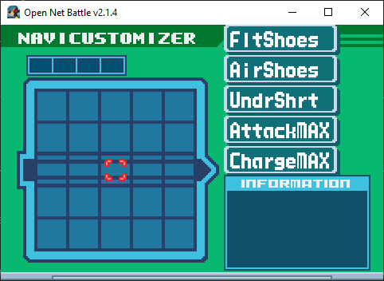{ align=center }

It's empty right now. Your installed Block mods will appear listed on the 
right. I've got a few for examples.

## Controls

Use UI Up/Down/Left/Right to move your cursor. If you move all the way to 
the right, off the Memory Map, or if you press Cancel...

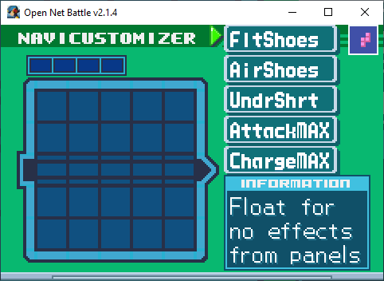{ align=center }

You'll be on the Block list. You can move up and down here with UI Left/Right, 
go back to the Memory Map with UI Right, or select a Block to place by using 
Confirm. You'll find the `RUN` button at the bottom, which we'll get back to 
later.

### Placing a Block

Once you've pressed Confirm on a Block in the list, you'll start placing it 
on the Memory Map.

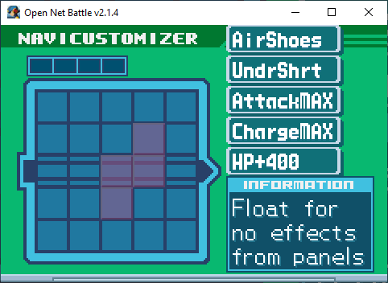{ align=center }

You can press Cancel to cancel. You can also move the part around with the 
UI Up/Down/Left/Right...

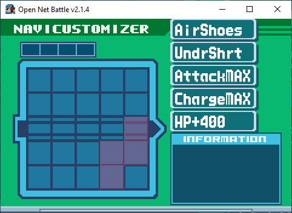{ align=center }

...rotate it with shoulder left or right...

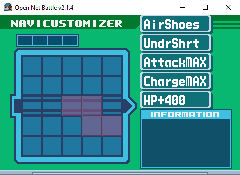{ align=center }

...and place it with Confirm.

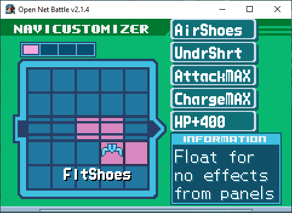{ align=center }

### Moving a Block

With your cursor on the Memory Map, you can press Confirm on a placed Block to 
get two new options:

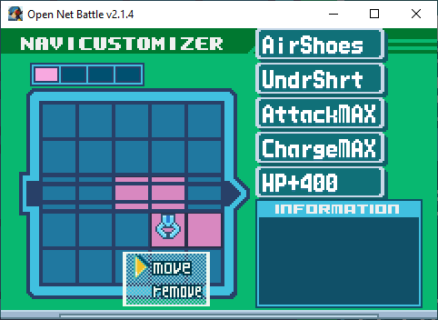{ align=center }

If you press Confirm on the `Move` option, you'll pick it back up again. Press 
Cancel to return it to is original state that you placed it in, or anything else 
you saw in the previous section.

If you press UI Down and then Confirm on the `remove` option, it'll be removed 
from the Memory Map and placed at the bottom of the Block list.

## Out of Bounds

Because this is based on BN6's NaviCust, you're allowed to place Blocks out of 
bounds. It can't have any part of it off the corners, and at least one part of 
it must be in bounds.

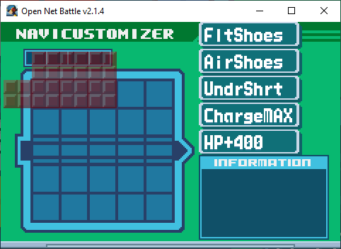{ align=center }

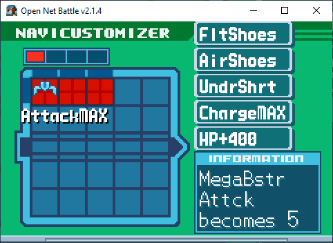{ align=center }

You'll see the edges darken where part of the Block is out of bounds (except on 
the Command Line, as a visual glitch in v2.1).

These out of bounds slots extend past the edges of the Command Line, too, and 
count as a Command Line slot for Program parts.

## Running

Once you're done making any changes, you can select the `RUN` button to save 
them. You can find this button at the bottom of the Block list.

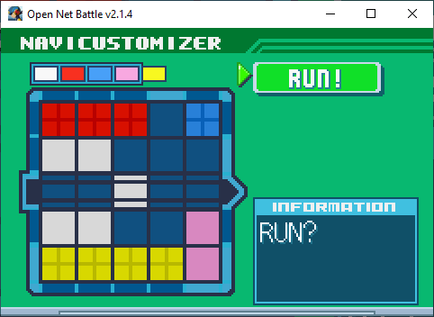{ align=center }

Press Confirm to Run it.

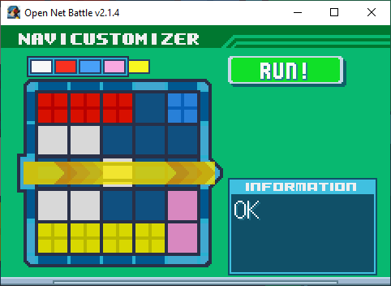{ align=center }

Your changes are saved to disk now. You'll then be prompted to leave or stay 
on this screen. Select whichever you prefer with the UI Left/Right buttons 
and Confirm (or Cancel to automatically choose NO, staying on the screen).

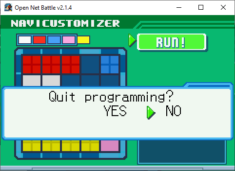{ align=center }

## Leaving

You can leave at any time by pressing Cancel while viewing the Block list. 

{ align=center }

If you do leave without running, your changes will not be saved.

## Program Parts

As you might remember from BN, NaviCust Blocks come in two flavors:

1. Program Parts, which appear solid
2. Plus Parts, which appear to have a + in them

Program Parts must have at least one part of them on the Command Line, or else 
they won't run. They'll still work if that one part is out of bounds in the 
same row as the Command Line. 

## Command Line

The Command Line is that strip of slots in the center of the NaviCust, with 
those extra black lines through them. There are 5 slots in bounds, and 1 
more on either side out of bounds, for a total of 7. The out of bounds slots 
still count as a Command Line slot for making Program Parts work. 

## Bugs

Normally, you would incur bugs for doing at least of the following:

1. Having any part of any Block out of bounds
2. Having any part of a Plus Block touching the Command Line
3. Having no part of a Program Part on the Command Line
4. Having more than 4 colors total represented in the NaviCust
5. Having two parts of the same color touching

The only "rule" ONB follows right now is that you must have at least one 
part of a Program Part on the Command Line, which prevents the Block from 
working. Otherwise, there are no bugs.

Some players like to play with a dummy Block, shaped like BugStop, to limit 
their NaviCust in a realistic way, and to be prepared for when bugs are 
introduced. You may want to talk with your opponents in PvP to see what they 
prefer.

When ONB does make bugs available, keep in mind that it may be up to modders 
to program the bug behavior for their Block mod, so there may still be no 
bugs until they have done that. 

## Copy/Paste

While not available in v2.1.4, the next version, v2.1.5, introduces copy/paste 
for NaviCust, [just like the folder can do](./folder_edit.md#copypaste).

Press Ctrl + C to copy the NaviCust to your clipboard. Here's how mine looks 
with AirShoes and SuperArmor:

````
```
# Cust by Alrysc
com.alrysc.block.airshoes,ca5f131c4d94e4f9709d2fee644263ba,16,0
com.OFC.block.EXE6-001-SuperArmor,9bd63b9d2d1cb1ecab85887455bd9a97,19,3
```
````
The first line includes the name you set in the [Config screen](./config.md).

Each line after that shows a Block's package ID, MD5 hash (essentially, their 
version), and then two numbers representing its location on the Memory Map, and 
its rotation.

You can then paste onto an empty NaviCust using Ctrl + V. You cannot paste 
if there are Blocks already placed.

You should hear one of two sounds:

1. The boost consumption sound, good: Everything pasted perfectly.
2. An error sound, bad: Something went wrong.

If you hear the error sound, check the console window (the black window that 
opened with the game) to see what went wrong. Sometimes, it's nothing to 
worry about. Here are the list of possible error causes:

1. At least one of the Blocks you tried to paste isn't installed
2. At least one of the Blocks you tried to paste is installed, but the paste 
wanted a different version than you had
3. At least one of the Blocks you tried to paste couldn't be added for another 
reason, like if it didn't fit in the spot it tried to be put into

Some errors will still let the Block be added, but others won't.

## Where's My HP?

You may have added Blocks that should raise your health, but didn't see any 
change. This could be for one of two reasons:

1. You're looking at the overworld HP
2. You just started battle and don't see the HP added

ONB v2.1 doesn't show HP changes on the overworld. You will likely see your 
new HP in battle.

If you start a battle and don't see the HP change, this is because you're 
using the HP+ Block mods that add your HP after you leave the Custom Screen, 
instead of at the start of battle. These are blocks that were made to combat 
a bug that existed in v2.0, where HP+ Blocks would raise your max health but 
not your starting health. 

As of v2.1, this is fixed, so you can use another HP+ Block mod and it should 
work as expected.

## Greyed Parts

If you're on a server with a whitelist, and your NaviCust contains any Blocks 
that are not allowed, those Blocks will appear greyed out on the Memory Map. 
These Blocks will be loaded, and will not affect your Player in battle. 

{ align=center }

You can read more about this on the [page about whitelists](../whitelists.md)
