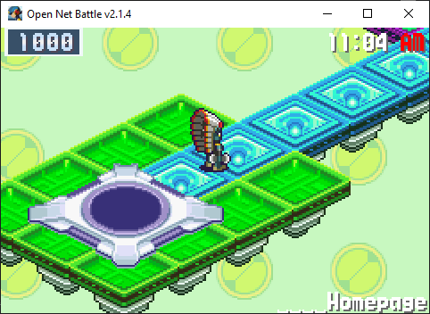
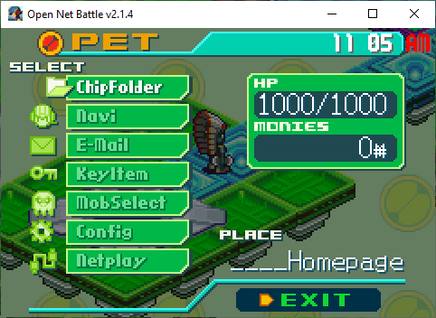

# Homepage

Once you've gotten past the [Start screen](./start_screen.md), you'll find 
yourself on your homepage. This is the offline hub area you'll use to 
connect to online servers, covered later.

{ align=center }

For now, press the Pause button again (Enter by default).

## Start Menu

Once you've pressed Pause (Enter by default) and opened the menu, you'll 
see something like this:

{ align=center }

There are 7 options here, each leading to another screen:

* [ChipFolder](./chip_folder.md)
* [Navi](./navi.md)
* [E-Mail](./email.md)
* [KeyItem](./key_item.md)
* [MobSelect](./mob_select.md)
* [Config](./config.md)
* [Netplay](./netplay.md)

You can also reach the `Exit` button you see in the corner, which will close 
the menu. You can also close it with the Cancel button (X by default).

Head to each of these pages to see what these screens can do. By default, you 
can navigate this and other menues using the arrow keys, X to cancel, and Z to 
confirm and enter a menu. 

I recommend going to the [Config](./config.md) screen first, so you can change 
your controls to be more comfortable if you need to, or to set up a controller 
to use as you check everything out.