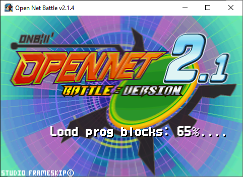
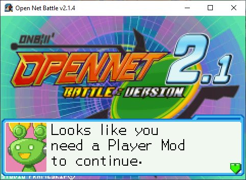

# Start

When you boot ONB, you'll be met by the loading sequence. After some text goes 
by (which you can skip with the Pause button), you'll see that your mods are 
loading. 

{ align=center }

This will take longer the more mods you have (and the larger they are), of 
course. 

Once this is done, you can press Pause again (Enter key on keyboard by 
default) and continue into ONB.

## No Player Loaded

If you don't have any (or any functioning) Player mods, you'll be unable to 
continue past the start screen.

{ align=center }

As you can tell, this means you'll need a Player mod. See 
[Loading Mods](../loading_mods.md) for loading mods. 

This could also mean you do have a Player mod, but none of them successfully
loaded. Maybe there is an error in its script, or maybe you put your ONB in 
One Drive or some place on your computer where it doesn't have read 
permissions for other files. These things will need to be fixed separately. 

## Controls and Controllers

ONB is missing default controller controls as of v2.1. You'll have to wait to 
use your controller until you can make it to the Config menu, where you can 
set it up.

For now, you'll have to make do with keyboard.