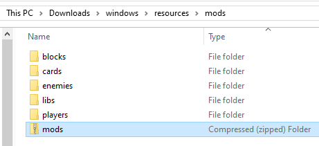
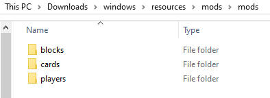
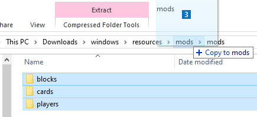
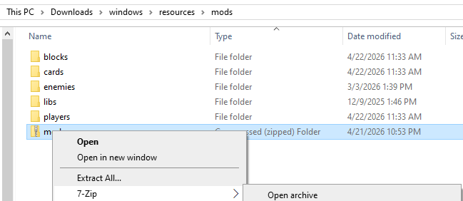
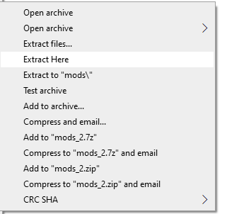
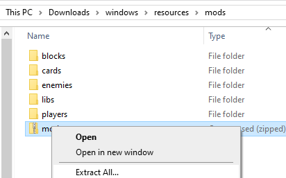
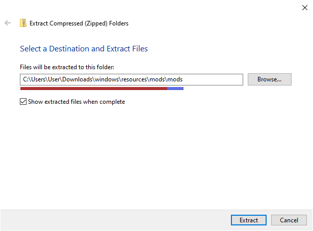
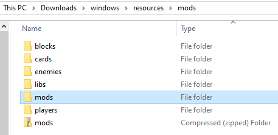
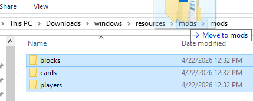
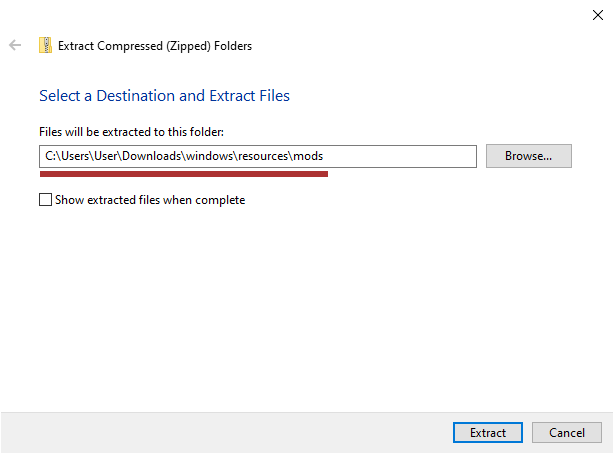

# Modsites

Instead of tracking down and downloading mod packages individually, most 
people use one of the mod websites, or modsites, instead. These make it easy 
to search and bulk download mods. You can find the current links for these 
by using the `/higsby` command in the Discord server.

I won't be providing the links here for a couple reasons:

1. I'm biased and think you should join us in the Discord community (there 
will be help there if you get stuck anywhere)
2. They might move and I'd have to update links
3. They might have down periods or issues that you wouldn't be aware of without 
being around the community

The guide here might seem long, but you're really clicking two or three times, 
so don't feel too daunted. You'll have it down and do it in a few seconds next 
time.

## If You Know What You're Doing

If you already know how to extract things, you can probably figure it out 
without the guide. Basically you just need to get the mod packages into 
the right folder. If you extract the ZIP you got from the modsite in place, 
the folders inside it will auto-merge with the ONB folders and you're good to 
go.

If they don't auto-merge and the way you extracted gives you an extra folder 
that the ZIP contents went into, just pull the insides of that folder up one 
directory so you can merge them with the ONB `mods` folders, or open a second 
window and drag them over, or cut and paste them to the ONB `mods` folder for 
the auto-merge.

## Downloaded ZIP

Once you have made your selections and download, you'll get a ZIP file that 
has all your downloads inside it. It might be called `mods.zip`, or maybe 
`MyMods-something.zip`, depending on which modsite you used. 

Put this ZIP into your ONB mods folder.

{ align=center }

In this example, I've selected a few blocks, cards, and players. If I look 
inside my `mods.zip` here, I'll see some folders inside.

{ align=center }

It looks almost just like the `mods` folder. Because it's set up this way, 
we can extract it and have the downloaded folders automatically merge with 
the ones in the ONB `mods` folder.

!!! info "Do not extract mods"
    Do not extract individual mod packages on your own. ONB 
    will do it in a special way on boot. When we talk about extracting here, 
    you'll only be extracting this `mods` download. It has more ZIPs inside, 
    but you will not extract any of these.

## Extracting

You have a few options for extracting this. 

### Just Pull Them Out

Windows usually lets you move files straight out of a ZIP file. It'll make an 
extracted copy instead of actually moving them.

Open up the ZIP file with your downloaded mods, select them all, and pull them 
over to the ONB `mods` folder. Here I do it from the address bar, but you can 
also open in a new window and move them like that.

{ align=center }

And you're done. You can open ONB now.

### 7-Zip

My preferred option is using 7-Zip, since it takes one click. You can download 
and install it from its official website, 
[https://www.7-zip.org/](https://www.7-zip.org/){:target="_blank"}. You can get 
its powers added to your right click menu, and it can extract .7z files and ZIP 
files.

If you right click the `mods.zip`, you'll see a `7-Zip` option, with an arrow 
like `>` on the right.

{ align=center }

If you hover your cursor over it, it'll open a menu next to it, like you see 
with the `Open Archive` above. The full menu is pictured here:

{ align=center }

The only one we care about here is `Extract Here`. If you click that, it'll 
extract the folders inside the ZIP and put them right here, in the ONB `mods` 
folder. Since that means pulling out the `cards` folder and putting it 
somewhere where there is already a folder named `cards`, these two folders 
merge. Basically, everything sorts out and you're done, and you can launch 
ONB now.

If you click `Extract files...` instead, 7-Zip will prompt you for where 
it should be extracted. This usually ends up placing all of the files into 
a brand new folder, named the same as the ZIP. You'll have one more step 
to do if you do it like that, just like the Windows 
[Extract all...](#extract-all). You'll just have to move the folders into 
the ONB `mods` folder, pulling them out of that extra folder you got.

### Extract All...

If you right click the `mods.zip`, you'll see an `Extract All...` option. 
Click it and Windows will give you a prompt for where the files should be 
extracted to.

{ align=center }

{ align=center }

I've underlined part of the filepath it shows with red, and the other part with 
blue. The red part, on the left, is the full path to the ONB `mods` folder. The 
blue part, on the right, is a folder that doesn't actually exist yet. If you 
leave it here, Windows will create a new folder right here with the same name 
as the ZIP you're extracting. Mine is `mods.zip`, which is why you see `\mods\mods` 
at the end (mods is there twice because of the ONB `mods` folder, and the new 
folder called `mods` that will be put inside it).

#### Leaving As-Is

You can click Extract here and it's fine. You'll just have one more step 
to do. If you want to avoid this step, go to 
[Avoid Extra Folder](#avoid-extra-folder).

Now that the files have been extracted and put into a folder, you might see 
this in your `mods` folder. It probably has the same name as the ZIP you 
extracted.

{ align=center }

They won't be loaded like this. We need to pull them out of this new folder. 
If you left the `Show extracted files when complete` box checked, this folder 
was opened in a new window. You can select them all and drag those folders 
to the ONB mods folder. Otherwise, open the new folder up and do the same.

{ align=center }

They'll all automatically merge and you're done. You can go launch ONB now. 

#### Avoid Extra Folder

You can skip that if you tell Windows to extract directly to the ONB `mods` 
folder instead of creating a new folder.

{ align=center }

Delete the blue underlined part and you're good to go. You may as well uncheck 
the extra box, too, since you already have that folder open.

{ align=center }

This will end up auto-merging the extracted folders with what's in the ONB 
`mods` folder. All done. You can open ONB now. 
