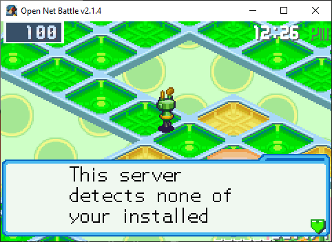
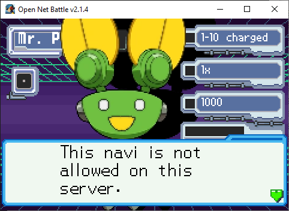
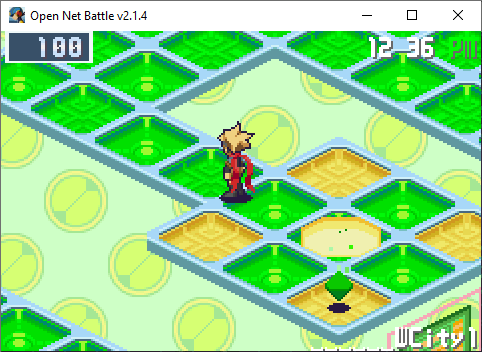
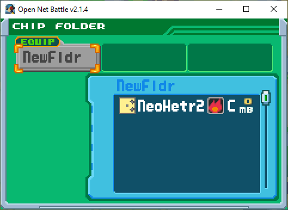
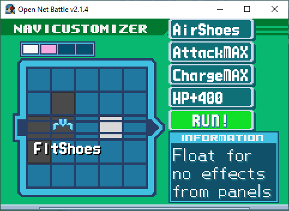

# Whitelists

"Whitelist" is a phrase you'll see around. For ONB, it refers to a list of 
allowed mods for a server. Servers impose these lists to curate their content 
for a few reasons:

* To make sure nobody can steamroll their enemies
* To make sure PvP players are on equal ground
* To spice up PvP by imposing limitations on builds, more like the BN games
* To force a particular "power level" they want players to approach their 
content with

If you think about servers as games, then whitelists are all of the chips, 
NaviCust parts, and playable characters in the game. 

This might feel against the openness of ONB, and it can be a shame to be 
unable to use your own player mod you've drawn and/or programmed, but 
hopefully you can understand some of these reasons a whitelist might exist.

There are made by server owners, so two servers might have different lists, 
and some don't have any at all.

## A Recommendation

As of now, it's strongly recommended to have a separate copy of ONB to use to 
play with a given server's whitelist. This makes it easy to:

* Update your mods when the whitelist updates
* Avoid mixing allowed and disallowed mods (huge hassle)

ONB itself is pretty small, so this is hopefully no issue. Remember to copy 
whatever files might be helpful to keep, in this case especially your `config.ini` 
so you don't need to redo your controls.

## But I Want to Use My Mod Anyway

Server owners are people, too, and you can try to get in touch with them in 
the community Discord server. Some of them might be willing to consider 
compromising with you, depending on their reasoning for having a whitelist. 

For example, with a server that aims for low power level, maybe they'll allow 
your mod if you weaken it. But maybe they're deads et on having exactly 10 
allowed Player mods, or 200 allowed chip mods, and they won't budge.

It's a change they have to make manually, though, so understand if it takes a 
while.

## Disallowed Mods

If you do enter a server with mods that aren't allowed, you'll see one of a 
few things.

### Bad Player Mod

Registering a whitelist can kick you from the server if you don't have any 
allowed Player mods.

{ align=center }

After this message, you'll be kicked.

If you have another mod that is allowed, you'll be prompted to switch.

{ align=center }

Once you've changed to one that is allowed, it'll stop bugging you.

{ align=center }

### Bad Card Mod

Any folder that has any number of chips that aren't allowed will appear greyed out.

{ align=center }

As of v2.1, you can't edit the folder or equip it, and you'll enter battle with 
no chips if you do have it equipped. 

It's hard to tell what the disallowed chip is, which is another reason to have 
a separate ONB copy per whitelist. Then you don't have to worry about mixing 
allowed and disallowed chips.

### Bad Block Mod

Any Block that is not on the whitelist will appeared darkened. 

{ align=center }

Here, my FloatShoes isn't whitelisted. It can still be here, but it won't 
activate in battle. 

## Downloading Allowed Mods

Usually you can find a download pack in the server's associated forum post 
in the community Discord server. If you've made a copy of ONB just for these 
mods, you can easily move them into your `mods` folder without worry of 
replacing things you don't mean to, or merging with mods that aren't allowed. 

## Strict Restrictions

Whitelists are made by specifying a package ID *and* MD5 hash for a mod. This 
means that you need the specific version of a mod for it to be allowed. This 
is why you'd usually download a pack of mods at once instead of finding them 
anywhere else. 

If the mod updated and you got a newer version, but the old version was the 
one that was whitelisted, ONB would say your newer version couldn't be used. 
Mod packs can preserve those older versions, to protect you from this until 
the pack is updated, and then you can replace the old mods.
